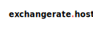

# Overview

* This is an application to showcase how to integrate a spring-boot project with a 3rd party FOREX or Foreign Exchange
  service.
* On this example, we'll try to mimic the behavior of having a service that's scheduled to pull rates from an external
  Forex service and persist them within our on-premise Oracle database.
* We'll utilize Oracle's `coherence` cache to increase our performance, hence we need to maintain the integrity of our
  records at the same time, so we don't end up utilizing invalid trade rates.
* Whenever trade rates are refreshed, a batching update for all trade rates will be executed.

## Acknowledgements

Thanks to [exchangerate.host](https://exchangerate.host/) for providing their free FOREX API.
> **exchangerate.host** is a Free foreign exchange, crypto rates & EU VAT Rates API.   
> If you or your company use this project or like what they're doing,
> please consider backing them, so they can continue maintaining
> and evolving this wonderful project.

<p align="center" style="padding:50px;background-color: white">

</p>


## Testing

1. Run the oracle service from this [docker-compose](/forex-local/docker-compose.yml) file.
2. Login using:

<table>
  <tr><td>username</td><td>system</td></tr>
  <tr><td>password</td><td>Pass@12345</td></tr>
  <tr><td>url</td><td>jdbc:oracle:thin:@localhost:1521:XE</td></tr>
</table>

3. Create a new user named `forex` with password `Forex@12345`.
4. Verify user existence:
```sql
SELECT * FROM all_users;
```
5. Grant the following permissions to forex.
```sql
GRANT CONNECT, RESOURCE, DBA TO FOREX;
```
6. The first time you run the application, the exchange cient will load all rates automatically.
7. You can look up scheduled tasks on [JobRunr dashboard](http://localhost:8000/dashboard).
8. Load this [.collections file]() into your postman and enjoy.

## Guides
### [Integrating Hibernate and Coherence](https://docs.oracle.com/middleware/12213/coherence/integrate/integrating-hibernate-and-coherence.htm#COHIG378).
### Cache Concurrency Strategy on Hibernate

- **READ_ONLY**: Used only for entities that never change (exception is thrown if an attempt to update such an entity is
  made). It's very simple and performative. It's suitable for static reference data that doesn't change.
- **NONSTRICT_READ_WRITE**: Cache is updated after the transaction that changed the affected data has been committed.
  Thus,
  strong consistency isn't guaranteed, and there's a small-time window in which stale data may be obtained from the
  cache. This kind of strategy is suitable for use cases that can tolerate eventual consistency.
- **READ_WRITE**: This strategy guarantees strong consistency, which it achieves by using ‘soft' locks. When a cached
  entity
  is updated, a soft lock is stored in the cache for that entity as well, which is released after the transaction is
  committed. All concurrent transactions that access soft-locked entries will fetch the corresponding data directly from
  the database.
- **TRANSACTIONAL**: Cache changes are done in distributed XA transactions. A change in a cached entity is either
  committed
  or rolled back in both the database and cache in the same XA transaction.

### [JobRunr](https://www.jobrunr.io/en/)

JobRunr is a Java library that makes it easy to run background jobs in a Java application.
It provides a simple and consistent API for scheduling, executing, and managing jobs
in a variety of environments, including web applications and microservices.  
More
info: [spring-integration](https://www.jobrunr.io/en/documentation/configuration/spring/) & [recurring jobs](https://www.jobrunr.io/en/documentation/background-methods/recurring-jobs).

#### Helpful cron expressions:
Every minute: `0 */1 * * * *`.  
Every 5 minutes: `0 */5 * * * *`.  
Every day at 04:00 pm: `0 0 16 * * *`.  
Every day at 12:05 am: `0 5 0 * * *`.

[](https://linkedin.com/in/zatribune)
[contributors-url]: https://github.com/zatribune/forex-service/graphs/contributors
[license-shield]: https://img.shields.io/github/license/zatribune/forex-example.svg?style=for-the-badge
[license-url]: https://github.com/zatribune/forex-example/blob/master/LICENSE.txt


